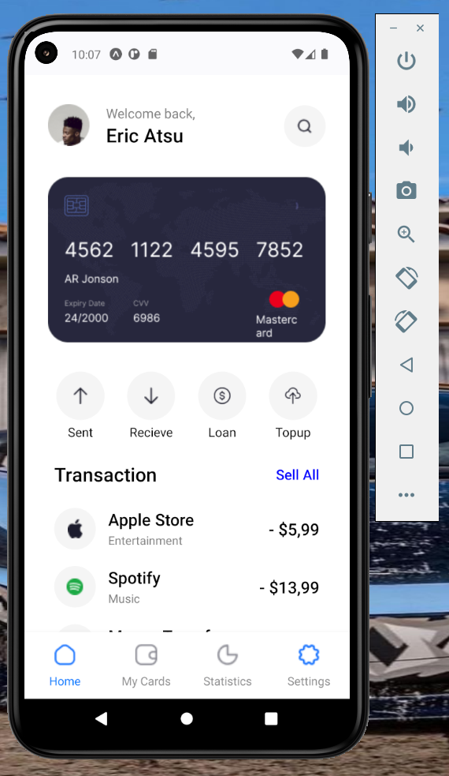
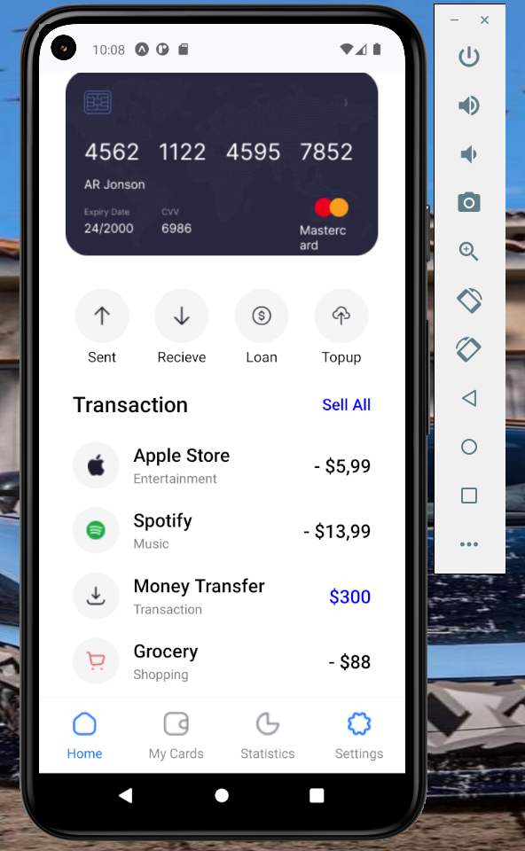
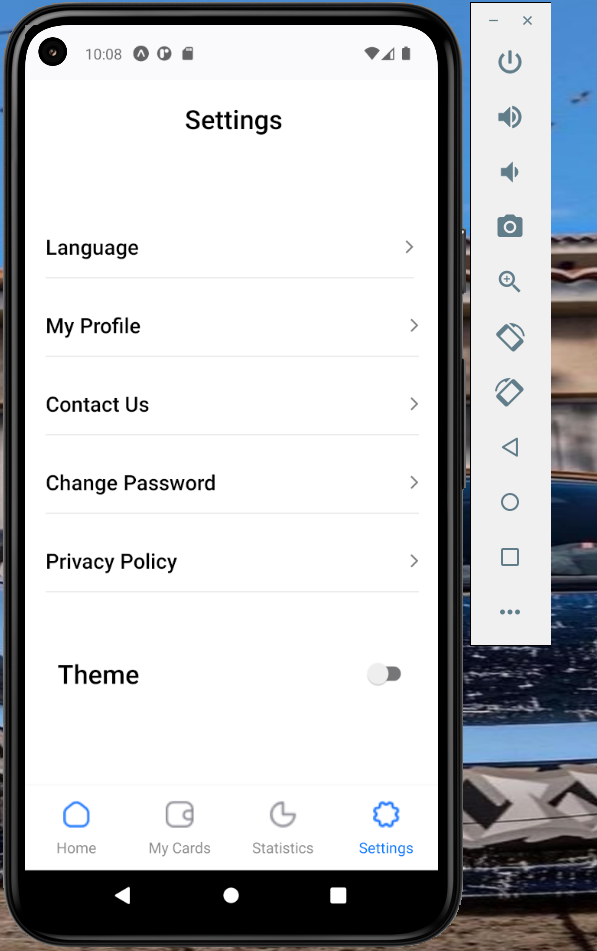
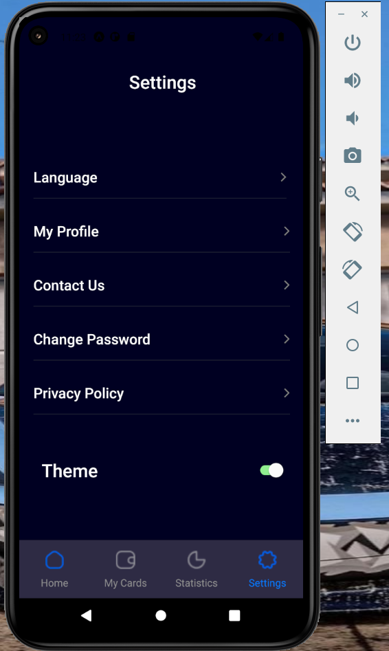
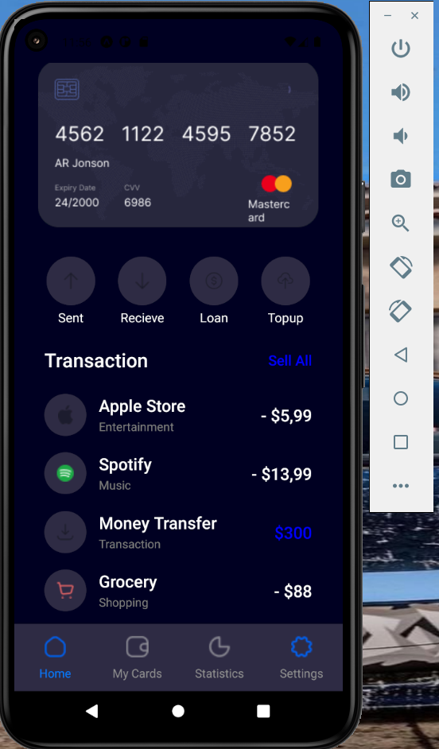

# TITLE: rn-assignment5-11293368

# Student Info

ID: 11293368

# Task Description

The task required creating a react native app using Expo CLI. The main aspect of the task was to create a design as seen in a provided UI mockup.
It also included: 
 
• Recreate the design as seen in the UI mockup. 

• Create the screens on the bottom tabs, especially the Home and Settings screens. 

• Create a feature in your mobile application that allows users to switch between light and dark themes as seen in the UI design. 

• Style the application to closely match the provided UI design. 

• Use custom components throughout the application. 

# Description of How I built my app:

"I began the process by first setting up all the folders and installing all packages, including those for the fonts and images. I also went on to divide the layout for each screen and created separate custom components. The process is as follows:
 
## Navigation:
For navigation on the Home page; I first installed and importing all the dependencies such as:  
- npm install @react-navigation/native
- npx expo install react-native-screens react-native-safe-area-context
- npm install @react-navigation/bottom-tabs
 
I made use of "Tab.navigator" and the "NavigatorContainer" in the App.js file which is the entry point of the application rendering the screens.
I then created a bottom tab navigator and added the various screens to it. I also added the icons for various representations. I made use of "Tab.navigator" and the "NavigatorContainer".

## HomeScreen:
This was mainly built using custom components I created. The first custom component rendered the intro text together with the card and profile image. 
The next component displayed the four icons spacing them out evenly. 
The last component displayed the list of the various tarnsactions. 
I also made use of the "FlatList" to encapsulate the whole page and make it vertically scrollable. 

## SettingsScreen:
The layout of this screen was much simpler so I didn't create any custom components for it. Just worked on it in the .js file. Created a text component at the top then various sections. I also made use of the "Switch" component which enables the user to switch between themes when pressed. 

# Screenshot of app:
 

 

 

 

 

 

